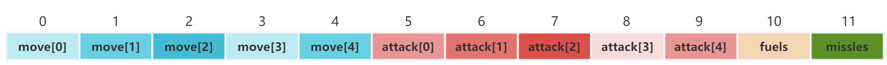

# DDPG

## 目录

<!--ts-->
* [简介](#简介)
    * [动作空间设计](#动作空间设计)
    * [状态空间设计](#状态空间设计)
    * [奖励机制](#奖励机制)
    * [优化DDPG](#优化DDPG)
      * [样本平衡](#样本平衡)
      * [数据增强](#数据增强)
      * [融合贪心](#融合贪心)
* [配置环境](#配置环境)
* [用法介绍](#用法介绍)
    * [config](#congfig)
    * [训练](#训练)
    * [测试](#测试)
<!--te-->

## 简介

本项目为2024年机器学习课程大作业，使用DDPG算法解决军事演习问题，本模型可以用于解决不同大小地图的军事演习问题，且可以使用预训练参数进行测试。

[任务描述](statement.pdf)

### 动作空间设计
MAX_FIGHTER为参与战斗的飞机数量。actions为一个长度为MAX_FIGHTER*12的向量，对于飞机i，actions[i\*12:i\*12+12] (action)为飞机i的动作向量。  



action由move、attack、fuels、missiles四个子向量组成。 

move为一个长度为5的向量，分别表示向上、向下、向左、向右、不动的概率，move的概率和为1。  

attack为一个长度为5的向量，分别表示将飞机现有的导弹向上、向下、向左、向右发射和存起来的比例，attack的比例和为1。  

fuels为一个长度为1的向量，表示飞机将现在所在我方基地(如果不是我方基地则无效)的燃料的百分之多少加到飞机上，fuels的值在0到1之间。  

missiles为一个长度为1的向量，表示飞机将现在所在我方基地(如果不是我方基地则无效)的导弹的百分之多少加到飞机上，missiles的值在0到1之间。

### 状态空间设计
observations为一个长度为MAX_FIGHTER*10的向量，对于飞机i，observations[i\*10:i\*10+10] (observation)为飞机i的状态向量。

observation由最近我方基地信息、最近敌方基地信息、飞机i信息三种信息组成。  

最近的一个己方基地的相对x坐标，相对y坐标，基地剩余燃油，基地剩余导弹 (4)  

最近的一个敌方基地的相对x坐标，相对y坐标，基地防御值，基地价值      (4)  

剩余燃油，剩余导弹                                          (2)  

### 奖励机制
奖励机制为每个飞机的四个动作的奖励之和。
1. move  
如果飞机不动，奖励为-2  
如果飞机移动，基础奖励为-1，如果靠近了敌方基地，奖励加上靠近的地方基地的价值*0.001  
如果飞机撞墙或者走到敌方基地，奖励为-5
2. attack  
如果飞机发射导弹打到了敌方基地，奖励为敌方基地失去的防御值，如果摧毁了敌方基地，奖励再加上敌方基地的价值
3. fuels  
飞机加油不奖励，由移动过程中的奖励来体现
4. missiles  
飞机加导弹不奖励，由攻击过程中的奖励来体现

### 优化DDPG
#### 样本平衡
由于军事演练问题中敌方基地较稀疏，导致很多时候飞机只能移动，而不能攻击，会选择把导弹存下来，即网络输出的action[5]到action[9]中  
只有action[9]为1，其他都为0。偶尔有一次攻击的机会，但是由于样本不平衡，网络很难学到攻击的策略。出现过拟合的情况。  

为了解决这个问题，我们在实现经验回放机制的时候，将reward大于0的样本和reward小于0的样本分开存储，每次从两种样本中取指定比例的样本进行训练。
以此来保证网络能够学到攻击的策略。

#### 数据增强
对于同一个环境，开始的动作衍生出的状态有限，很多是相同的，越到后面多样性越高。为了从有限数量的环境中学到应对不同情况的策略，可以在0到每轮迭
代走的步数/2之间随机选一个数作为训练开始的标志。这样可以让开头的状态被选到的概率减小，而后面的状态被选到的概率增大。  
该方法一方面增强了数据多样性，另一方面避免了网络反复学习相同的样本导致过拟合，提高了网络的泛化能力。

#### 融合贪心
在测试的时候，为了避免环境经过一个动作的处理后，所有飞机观测到的状态和以前一样，导致网络又做出了相同的动作，自此进入死循环，需要强制要求飞机
向某个方向移动。但不是简单地把attack[4]所占概率设为0，而是可以在飞机选择不移动时加入人为设定的贪心策略，如向导弹和燃油充足时向敌方基地移动，
不足时向我方基地移动。这样可以让网络在测试的时候获得更好的表现。  
还可以在测试程序检测到飞机当前状态和上一次状态相同时，换成使用贪心策略，这个本项目没有实现。

## 配置环境
```shell
pip install -r requirements.txt
```

将testcase.in放到data文件夹下，网络运行完成后会将结果也保存到该文件夹下

## 用法介绍
### config

`config.py`文件定义了一些参数来配置项目。以下是这些参数的简单介绍：

- `net`：使用的网络类型，本项目中为'MDDPG'。
- `batch_size`：每次训练的批次大小。
- `memory_capacity`：记忆库的容量。
- `tau`：用于软更新的参数。
- `action_noise`：用于探索的噪声。
- `gamma`：折扣因子，用于计算未来奖励的价值。
- `sight`：智能体的视野范围。用于获得最近的我方基地和敌方基地的信息、处理move动作的奖励时能探索到的范围。
- `alpha`，`beta`：优化器的学习率。
- `epochs`：训练的总周期数。
- `epoch_save`：每隔多少周期保存一次模型。
- `positive_sample_proportion`：一个batch中正样本的比例。
- `load_dir`：模型加载的目录。
- `episode`：加载目录下哪一个episode的模型。
- `train_name`：训练数据的来源，如果为None则使用随机生成的数据。
- `train_load`：是否从指定的目录加载模型进行训练。
- `test_name`：测试数据的来源。
- `RESULT_PATH`：结果保存的顶层目录。
- `out_dir`：模型保存的路径。
- `MAX_FIGHTER`：参与战斗的飞机最大数量。

### 训练

如果需要加载已有模型进行训练，需要在config.py中把load_dir设置为保存模型的目录, episode设置为加载第几轮生成的模型。
(如10，20，'best'), train_load设为True。如果不需要加载已有模型，train_load设为False。  

在config.py中设置好train_name等参数后，运行train.py文件即可开始训练。 

生成的模型会保存在`out_dir`文件夹下，每隔`epoch_save`周期保存一次，不定时保存best模型。

### 测试

设定好load_dir、episode和test_name后，运行test.py文件即可开始测试。测试结果为一个out文件，会保存在data文件夹下。